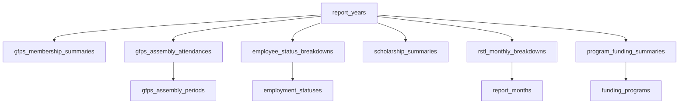

# Yearly Reports Database Guide

## Purpose

This document explains how the yearly reports database was created for the GAD Corner project.

It is written to be:

- easy to follow,
- clear about what was created,
- practical for future maintenance,
- aligned with the actual code already in this repository.

This database was designed to replace the old hard-coded yearly chart values that previously lived inside the frontend.

## What Problem This Solves

Before this database work, the yearly report charts were using fixed values inside the old frontend (for example a year modal and static `years` data files). Those paths are no longer the source of truth.

That meant:

- data had to be edited in code,
- yearly records were not stored in MySQL,
- adding new years was manual and error-prone,
- the data was not normalized.

The new database structure moves those report values into proper Laravel/MySQL tables so yearly report data can be stored, managed, and later edited through a user interface.

## High-Level Design

The database was built using a **normalized structure**.

Instead of putting everything into one giant table or one JSON column, the data was split into:

1. one parent table for the year,
2. lookup tables for repeated labels,
3. fact tables for each report section.

This makes the system easier to validate, easier to update, and easier to scale when more years are added.

## Main Idea

Each annual report is stored in one record in `report_years`.

That record then connects to the actual yearly report sections:

- GFPS membership
- GFPS assembly attendance
- employee status breakdown
- scholarship summary
- RSTL monthly breakdown
- program funding summaries

Repeated labels such as months, employment statuses, and funding program names are stored in separate lookup tables.

## Database Creation Flow

The database was created in this order:

1. create the parent `report_years` table,
2. create lookup tables,
3. create yearly fact tables,
4. create Eloquent models and relationships,
5. create lookup seeders,
6. create a dedicated seeder for the old 2025 hard-coded values,
7. wire the public app to read from MySQL (homepage + report detail via `ReportYearTransformer`, **published-only** on public routes),
8. add session login/logout and policy-protected management routes (role-based editors + administrators).

## Migrations That Created The Tables

These migration files created the database structure:

- `database/migrations/2026_04_07_012647_create_report_years_table.php`
- `database/migrations/2026_04_07_012657_create_report_lookup_tables.php`
- `database/migrations/2026_04_07_012658_create_report_fact_tables.php`

Later migrations define **login identity** and **who may manage** yearly reports at the account level:

- `database/migrations/2026_04_14_000001_add_is_admin_to_users_table.php` (historical) — originally added `users.is_admin` (boolean).
- `database/migrations/2026_04_15_000001_add_username_to_users_table.php` — adds `users.username` (unique) for session sign-in; existing rows get a backfilled value.
- `database/migrations/2026_04_22_000001_add_role_to_users_and_drop_is_admin.php` — replaces `is_admin` with `users.role` (string, matches `App\Enums\UserRole`), migrates `is_admin = 1` → `administrator`, `is_admin = 0` → `none`, then drops `is_admin`.

## Parent Table

### `report_years`

This is the main record for each yearly report.

Columns:

- `id`
- `year`
- `title`
- `description`
- `status`
- `published_at`
- `created_at`
- `updated_at`

Why it exists:

- one record represents one report year,
- frontend year cards use this table,
- published vs pending state is stored here.

Important rules:

- `year` is unique, so only one `2025` report can exist.
- **Public site** (`/` and `/reports/{reportYear}`) only exposes rows where `status` is **published**. Rows with `status` **pending** stay in MySQL for management use (`/report-years` and edit flows) until they are **published** (a capability reserved to **administrator** accounts; see below).

## Users table and who can edit reports

Report-year **data** lives in the tables above, but **editing** is restricted by `users.role` and `App\Policies\ReportYearPolicy` (enforced in form request `authorize()` methods).

The `users` table has (among standard Laravel columns):

- `username` — unique string used for **web session login** (with `password`). Sign-in is **not** by email. Validation allows letters, numbers, and `._-` (see `App\Http\Requests\Auth\LoginRequest`).
- `role` — one of: `none`, `administrator`, `gad`, `scholarship`, `hr`, `rstl`, `tos` (`App\Enums\UserRole`). This is application authorization, not a foreign key on `report_years`. There is no `created_by` on yearly report rows; access is “whoever the policy allows, by section, for any year they can open.”

**Rough mapping (all subject to the policy in code):**

| Role            | List/open edit UI | Create/delete year, publish | Section updates                                                                          |
| --------------- | ----------------- | --------------------------- | ---------------------------------------------------------------------------------------- |
| `none`          | no (403)          | no                          | no                                                                                       |
| `administrator` | yes               | yes                         | all                                                                                      |
| `gad`           | yes               | no                          | metadata (year/title/description via `metadata` route), GFPS membership, GFPS assemblies |
| `scholarship`   | yes               | no                          | scholarship                                                                              |
| `hr`            | yes               | no                          | employee status                                                                          |
| `rstl`          | yes               | no                          | RSTL by month                                                                            |
| `tos`           | yes               | no                          | program funding                                                                          |

**Full** `PATCH /report-years/{id}` (including **status** / publish) is **administrator** only. **Gad** and other non-admin roles that may edit **metadata** use `PATCH /report-years/{id}/metadata` (year, title, description) so `published_at` / `status` stay under administrator control.

`database/seeders/DatabaseSeeder.php` calls `UserSeeder` after report seeders. **`UserSeeder`** (see below) always seeds the primary administrator. When `APP_ENV=local`, it also seeds **five** report-editor users (`gad` through `tos`); it does **not** seed `UserRole::Administrator` again (that is the primary admin) or `UserRole::None` (use `User::factory()` or a manual row to test `none`). For tests and ad-hoc records, `database/factories/UserFactory.php` defaults `role` to `administrator` and generates a unique `username`.

### `UserSeeder` and seed passwords

`database/seeders/UserSeeder.php` uses `Model::unguarded()` when writing `role` (not mass-assignable on `User` in normal app code). All seeded emails share one domain: private const `EMAIL_DOMAIN` in that class is `r9.dost` (e.g. `gad@r9.dost`). **Upsert key is always `username`** so changing an email in the seeder does not try to insert a second row and violate the unique index.

- **Primary administrator** — `updateOrCreate` on `username` `ARR`, sets `email` to `dost9arrgad@r9.dost` and `UserRole::Administrator`. Password: `PRIMARY_ADMIN_PASSWORD` in `.env`, or the seeder’s default if unset (set the env var in production).
- **Local-only** (`APP_ENV=local`) — one row per report-editor role, usernames: `GADStaff`, `ScholarshipStaff`, `HRStaff`, `RSTLStaff`, `TOSStaff` (emails `gad@` … `tos@` + domain). Shared password: `LOCAL_SAMPLE_PASSWORD` in `.env`, or the seeder’s default (see `UserSeeder`).

`.env.example` lists `PRIMARY_ADMIN_PASSWORD` and `LOCAL_SAMPLE_PASSWORD` as optional overrides.

### Session authentication (login / logout)

Report management and settings routes live behind Laravel’s `auth` middleware. Unauthenticated visitors are redirected to **`/login`** (`login` route); signing out uses **`POST /logout`** (`logout` route). Credentials are posted to **`store`** on the login form: **`username` + `password`** (handled by `App\Http\Requests\Auth\LoginRequest` and `App\Http\Controllers\Auth\AuthenticatedSessionController`).

**Default redirect after login:** if `url.intended` in the session is a safe in-app target, that wins; otherwise users whose role is not `none` go to `/report-years` (route name `report-years.index` — the report year list) via `User::shouldDefaultLoginToReportYears()` / `UserRole::canAccessReportManagement()`. Users with `role = none` go to the public home. This is **not** stored in the yearly-report tables; it only controls who reaches the management UI and where they land first.

## Lookup Tables

Lookup tables were added so repeated labels are not duplicated inside every yearly row.

### `employment_statuses`

Stores employee categories:

- Plantilla
- COS
- Agency
- JO

Columns:

- `id`
- `name`
- `slug`
- `sort_order`

### `gfps_assembly_periods`

Stores GFPS assembly periods:

- 1st Assembly
- 2nd Assembly
- 3rd Quarter
- 4th Quarter

Columns:

- `id`
- `name`
- `slug`
- `sort_order`

### `report_months`

Stores the 12 months used in the RSTL section.

Columns:

- `id`
- `name`
- `short_name`
- `month_number`

### `funding_programs`

Stores funding sections:

- SETUP
- CEST

Columns:

- `id`
- `name`
- `slug`
- `sort_order`

## Fact Tables

Fact tables store the actual report values for a specific year.

### `gfps_membership_summaries`

Stores the yearly GFPS sex totals.

Columns:

- `report_year_id`
- `female_count`
- `male_count`

Key rule:

- one row per year only

### `gfps_assembly_attendances`

Stores attendance by assembly period and sex.

Columns:

- `report_year_id`
- `gfps_assembly_period_id`
- `female_count`
- `male_count`

Key rule:

- one row per year per assembly period

### `employee_status_breakdowns`

Stores employee counts by employment status and sex.

Columns:

- `report_year_id`
- `employment_status_id`
- `female_count`
- `male_count`

Key rule:

- one row per year per employment status

### `scholarship_summaries`

Stores the yearly scholarship summary.

Columns:

- `report_year_id`
- `school_year_label`
- `as_of_date`
- `female_count`
- `male_count`

Key rule:

- one row per year only

### `rstl_monthly_breakdowns`

Stores monthly RSTL data.

Columns:

- `report_year_id`
- `report_month_id`
- `female_count`
- `female_led_count`
- `male_count`
- `male_led_count`

Key rule:

- one row per year per month

### `program_funding_summaries`

Stores SETUP and CEST funding data.

Columns:

- `report_year_id`
- `funding_program_id`
- `female_projects`
- `female_amount`
- `male_projects`
- `male_amount`

Key rule:

- one row per year per funding program

Important note:

- money is stored using `decimal(15,2)`, not float

## Why The Structure Is Normalized

This database is normalized because:

- repeated labels were moved into lookup tables,
- each table represents one clear business concept,
- duplicate text values were reduced,
- derived values are not stored,
- parent-child relationships are explicit.

Examples of values that are **not** stored directly:

- total members
- total employees
- total scholars
- total customers
- percentages
- combined overview totals

These are calculated in PHP when the frontend needs them.

That keeps the database cleaner and prevents conflicting totals.

## Relationships

The parent-child relationship works like this:



## Laravel Models Created

The following Eloquent models were created for report data (plus `app/Models/User.php` for session auth, `users.role`, and `users.username`):

- `app/Models/ReportYear.php`
- `app/Models/EmploymentStatus.php`
- `app/Models/GfpsAssemblyPeriod.php`
- `app/Models/ReportMonth.php`
- `app/Models/FundingProgram.php`
- `app/Models/GfpsMembershipSummary.php`
- `app/Models/GfpsAssemblyAttendance.php`
- `app/Models/EmployeeStatusBreakdown.php`
- `app/Models/ScholarshipSummary.php`
- `app/Models/RstlMonthlyBreakdown.php`
- `app/Models/ProgramFundingSummary.php`

These models define:

- fillable fields,
- casts,
- one-to-one relations,
- one-to-many relations,
- belongs-to relations.

`ReportYear` is the main parent model.

Public Inertia payloads are shaped by **`App\Support\ReportYearTransformer`** (`toCardArray()` for homepage cards, `toDetailArray()` for the public report page), so the database shape stays separate from chart-friendly JSON.

## Seeders Created

Important seeders include:

### `database/seeders/ReportLookupSeeder.php`

This seeds the lookup tables:

- employment statuses,
- GFPS assembly periods,
- months,
- funding programs.

It uses `upsert`, so it is safe to run multiple times.

### `database/seeders/ReportYear2025Seeder.php`

This inserts the old hard-coded 2025 values into the normalized tables.

It includes:

- GFPS membership totals,
- GFPS assembly attendance values,
- employee status breakdown values,
- scholarship summary,
- all 12 RSTL monthly values,
- SETUP funding values,
- CEST funding values.

It also uses `updateOrCreate`, so it is idempotent.

That means you can run it again without creating duplicate 2025 rows.

### `database/seeders/UserSeeder.php`

Creates the primary administrator and, in local, five report-editor accounts (`gad`…`tos`). Does not create a `none` role user. Details: [Users table and who can edit reports](#users-table-and-who-can-edit-reports) → **`UserSeeder` and seed passwords**.

## The Old 2025 Data

The original 2025 values came from the old frontend constants (before the normalized `report_years` / fact tables).

Those values were moved into the database through:

- `report_years`
- `gfps_membership_summaries`
- `gfps_assembly_attendances`
- `employee_status_breakdowns`
- `scholarship_summaries`
- `rstl_monthly_breakdowns`
- `program_funding_summaries`

So instead of storing 2025 numbers inside Vue, the app now reads them from MySQL.

## How The Frontend Now Reads The Data

### Public homepage (`/`)

The homepage is loaded through:

- `app/Http/Controllers/HomeController.php`

This controller:

1. loads **`ReportYear` records with `status = published` only** (ordered by `year` descending),
2. maps each row through `App\Support\ReportYearTransformer::toCardArray()` (lightweight card props: id, year, href, description, etc.—**no** `reportData` on the index),
3. sends them to the Inertia page.

The public page then renders:

- `resources/js/pages/Index.vue`
- `resources/js/components/home/YearlySection.vue`
- `resources/js/components/home/YearCard.vue`

### Public report detail (`/reports/{reportYear}`)

The per-year report page is loaded through:

- `app/Http/Controllers/ReportYearPublicController.php`

This controller:

1. returns **404** unless the year is **published** (`abort_unless` on status),
2. **eager-loads** related fact tables (membership, assemblies, employees, scholarship, RSTL months, funding),
3. maps the model through `ReportYearTransformer::toDetailArray()` (includes `reportData` for charts when published).

The detail page renders:

- `resources/js/pages/reports/Show.vue`

Charts and sections use **props from Laravel**, not hard-coded JSON in the frontend.

## How The Management Side Was Prepared

The project also includes report maintenance scaffolding for manual entry:

- `app/Http/Controllers/ReportYearManagementController.php` — `index` / `edit` call `$this->authorize(...)`; mutations go through form requests below; `updateMetadata` serves the non-admin metadata route.
- `app/Policies/ReportYearPolicy.php` — `viewAny` / `view`: any role except `none` (so editors can open the list and a year’s edit page). `create` / `delete` / full `update` (incl. publish): `administrator` only. Per-section: `updateMetadata`, `updateGfpsMembership`, `updateGfpsAssemblies`, `updateScholarship`, `updateEmployeeStatuses`, `updateRstlMonthly`, `updateProgramFunding` (see table above).
- `app/Http/Requests/StoreReportYearRequest.php`
- `app/Http/Requests/UpdateReportYearRequest.php` (full year + status; administrators)
- `app/Http/Requests/UpdateReportYearMetadataRequest.php` (year, title, description; `updateMetadata` on the policy—used when the UI saves metadata without changing publish `status`, e.g. **Gad** on `PATCH /report-years/{id}/metadata`)
- `app/Http/Requests/UpdateGfpsMembershipSummaryRequest.php`
- `app/Http/Requests/UpdateGfpsAssemblyAttendancesRequest.php`
- `app/Http/Requests/UpdateEmployeeStatusBreakdownsRequest.php`
- `app/Http/Requests/UpdateScholarshipSummaryRequest.php`
- `app/Http/Requests/UpdateRstlMonthlyBreakdownsRequest.php`
- `app/Http/Requests/UpdateProgramFundingSummariesRequest.php`

Each update request’s `authorize()` checks the policy against the route’s `reportYear` (or `create` for new years).

Routes live in `routes/web.php` under `Route::middleware('auth')->prefix('report-years')->...` so only signed-in users hit the controller; the policy then enforces the right role for each action. Guest access to protected routes redirects to **`/login`**.

Shaped Inertia data:

- `HandleInertiaRequests` shares `auth.user.role` and `auth.user.can` (`accessReportYears`, `createReportYears`, `deleteReportYears`) for nav and list UI.
- `ReportYearManagementController@edit` passes an `abilities` object per section (which tabs and save actions are available).

Frontend maintenance pages:

- `resources/js/pages/reports/Index.vue` — list years; create shell / delete year shown only when `can.createReportYears` / `can.deleteReportYears` (administrators). Editors without create still open **Edit** for allowed sections.
- `resources/js/pages/reports/Edit.vue` — section-by-section updates; tabs hidden when the user has no ability for that section; metadata status control only for administrators.

On the **public home** layout, users with `can.accessReportYears` see a **Reports** dropdown (`resources/js/components/home/HomeTopNav.vue`); **New report year** appears only if `can.createReportYears` is true. App shell sidebars/headers use the same flags. The server always enforces policy (403 if the user’s role does not allow that mutation).

These pages were designed so users can update one section at a time.

### Quick access (sign in → manage reports)

1. **URL:** `/login` (guest-only; after login you are redirected away from this route).
2. **Credentials:** **username** + password (the `users.username` value, not email). Seeded accounts: primary `ARR`, local samples `GADStaff`, `ScholarshipStaff`, `HRStaff`, `RSTLStaff`, `TOSStaff` (local only; see `UserSeeder`).
3. **Who can open report management:** any user whose `users.role` is not `none` (editors and administrators). Set `role` in the database to match each account’s responsibilities (`gad`, `scholarship`, `hr`, `rstl`, `tos`, or `administrator` for full control).
4. **After login:** users who may access report years are sent to `/report-years` by default (unless the session had another safe “intended” URL). Users with `role = none` go to the public home.
5. **Workflow:** `/report-years` → (if allowed) create a year or open **Edit** → fill the sections your role can change → an **administrator** sets **status** to **published** when the public site should show that year.

## Commands Used

### To run migrations

```bash
php artisan migrate
```

### To seed lookup tables only

```bash
php artisan db:seed --class=ReportLookupSeeder
```

### To insert the old 2025 data

```bash
php artisan db:seed --class=ReportYear2025Seeder
```

### To seed everything from `DatabaseSeeder`

```bash
php artisan db:seed
```

### To re-run user seeding only (idempotent `updateOrCreate`)

```bash
php artisan db:seed --class=UserSeeder
```

## What `php artisan migrate` Actually Does

`php artisan migrate` only creates the tables.

It does **not** automatically insert yearly report rows like `2025`.

That is why the database could exist while `report_years` was empty.

The `2025` data only appeared after running the seeder.

## Verification That 2025 Was Inserted

After the seeder was run, the database contained:

- one `report_years` row for `2025`
- `4` GFPS assembly rows
- `4` employee status rows
- `12` RSTL monthly rows
- `2` funding summary rows

That confirms the old hard-coded data is now stored in the database.

## Important Design Decisions

### 1. Aggregated yearly values only

The database was intentionally designed for yearly summary data, not raw person-level data.

That means:

- no individual employees,
- no per-person scholar records,
- no per-customer RSTL rows,
- no per-project transaction ledger.

Instead, it stores the summarized figures that match the charts.

### 2. Derived totals are calculated, not stored

This avoids data mismatch problems.

Example:

- if `female_count` or `male_count` changes,
- percentages and totals should automatically reflect the new values,
- so they are computed in PHP rather than duplicated in the database.

### 3. Lookup tables were preferred over repeated strings

This improves:

- consistency,
- sorting,
- validation,
- future expansion.

## If You Want To Add Another Year

The recommended future flow is:

1. create a new record in `report_years`,
2. set its `status` to `pending`,
3. fill each section,
4. publish it when complete (`status = published`, set `published_at` as appropriate),
5. confirm it appears on `/` and is reachable at `/reports/{id}` (pending years never show on the public site).

Example years that can be added later:

- `2026` as pending
- `2027` as pending or published

## If You Need To Reset Everything

Use this only if you intentionally want to rebuild the database:

```bash
php artisan migrate:fresh --seed
```

That will:

- drop all tables,
- recreate all tables,
- run the seeders again.

## Summary

The yearly reports database was created by:

1. defining a normalized schema,
2. creating Laravel migrations,
3. adding Eloquent models and relationships,
4. seeding lookup tables,
5. seeding the original 2025 hard-coded values,
6. updating the app to read report data from MySQL.

As a result:

- the database now stores the yearly report structure properly,
- 2025 lives in MySQL instead of Vue constants,
- the app is ready for future manual yearly report entry,
- **published** years are listed on the public homepage and viewable at `/reports/{id}`; **pending** years remain in the database only until published,
- session sign-in uses **`users.username`** + password; after signing in, users with a non-`none` `users.role` can use the report management UI within their allowed sections; `users.role = none` has no access; **administrators** can create/delete years and control publish status. All changes are enforced by `ReportYearPolicy` and form requests, not only the UI.
