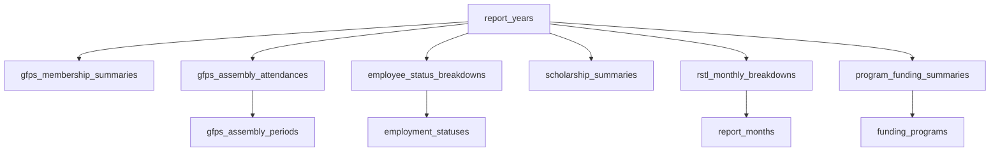

# Yearly Reports Database Guide

## Purpose

This document explains how the yearly reports database was created for the GAD Corner project.

It is written to be:

- easy to follow,
- clear about what was created,
- practical for future maintenance,
- aligned with the actual code already in this repository.

This database was designed to replace the old hard-coded yearly chart values that previously lived inside the frontend.

## What Problem This Solves

Before this database work, the yearly report charts were using fixed values inside:

- `resources/js/components/YearModal.vue`
- `resources/js/data/years.ts`

That meant:

- data had to be edited in code,
- yearly records were not stored in MySQL,
- adding new years was manual and error-prone,
- the data was not normalized.

The new database structure moves those report values into proper Laravel/MySQL tables so yearly report data can be stored, managed, and later edited through a user interface.

## High-Level Design

The database was built using a **normalized structure**.

Instead of putting everything into one giant table or one JSON column, the data was split into:

1. one parent table for the year,
2. lookup tables for repeated labels,
3. fact tables for each report section.

This makes the system easier to validate, easier to update, and easier to scale when more years are added.

## Main Idea

Each annual report is stored in one record in `report_years`.

That record then connects to the actual yearly report sections:

- GFPS membership
- GFPS assembly attendance
- employee status breakdown
- scholarship summary
- RSTL monthly breakdown
- program funding summaries

Repeated labels such as months, employment statuses, and funding program names are stored in separate lookup tables.

## Database Creation Flow

The database was created in this order:

1. create the parent `report_years` table,
2. create lookup tables,
3. create yearly fact tables,
4. create Eloquent models and relationships,
5. create lookup seeders,
6. create a dedicated seeder for the old 2025 hard-coded values,
7. wire the frontend to read from the database instead of local constants.

## Migrations That Created The Tables

These migration files created the database structure:

- `database/migrations/2026_04_07_012647_create_report_years_table.php`
- `database/migrations/2026_04_07_012657_create_report_lookup_tables.php`
- `database/migrations/2026_04_07_012658_create_report_fact_tables.php`

## Parent Table

### `report_years`

This is the main record for each yearly report.

Columns:

- `id`
- `year`
- `title`
- `description`
- `status`
- `color_theme`
- `background_image`
- `published_at`
- `created_at`
- `updated_at`

Why it exists:

- one record represents one report year,
- frontend year cards use this table,
- published vs pending state is stored here.

Important rule:

- `year` is unique, so only one `2025` report can exist.

## Lookup Tables

Lookup tables were added so repeated labels are not duplicated inside every yearly row.

### `employment_statuses`

Stores employee categories:

- Plantilla
- COS
- Agency
- JO

Columns:

- `id`
- `name`
- `slug`
- `sort_order`

### `gfps_assembly_periods`

Stores GFPS assembly periods:

- 1st Assembly
- 2nd Assembly
- 3rd Quarter
- 4th Quarter

Columns:

- `id`
- `name`
- `slug`
- `sort_order`

### `report_months`

Stores the 12 months used in the RSTL section.

Columns:

- `id`
- `name`
- `short_name`
- `month_number`

### `funding_programs`

Stores funding sections:

- SETUP
- CEST

Columns:

- `id`
- `name`
- `slug`
- `sort_order`

## Fact Tables

Fact tables store the actual report values for a specific year.

### `gfps_membership_summaries`

Stores the yearly GFPS sex totals.

Columns:

- `report_year_id`
- `female_count`
- `male_count`

Key rule:

- one row per year only

### `gfps_assembly_attendances`

Stores attendance by assembly period and sex.

Columns:

- `report_year_id`
- `gfps_assembly_period_id`
- `female_count`
- `male_count`

Key rule:

- one row per year per assembly period

### `employee_status_breakdowns`

Stores employee counts by employment status and sex.

Columns:

- `report_year_id`
- `employment_status_id`
- `female_count`
- `male_count`

Key rule:

- one row per year per employment status

### `scholarship_summaries`

Stores the yearly scholarship summary.

Columns:

- `report_year_id`
- `school_year_label`
- `as_of_date`
- `female_count`
- `male_count`

Key rule:

- one row per year only

### `rstl_monthly_breakdowns`

Stores monthly RSTL data.

Columns:

- `report_year_id`
- `report_month_id`
- `female_count`
- `female_led_count`
- `male_count`
- `male_led_count`

Key rule:

- one row per year per month

### `program_funding_summaries`

Stores SETUP and CEST funding data.

Columns:

- `report_year_id`
- `funding_program_id`
- `female_projects`
- `female_amount`
- `male_projects`
- `male_amount`

Key rule:

- one row per year per funding program

Important note:

- money is stored using `decimal(15,2)`, not float

## Why The Structure Is Normalized

This database is normalized because:

- repeated labels were moved into lookup tables,
- each table represents one clear business concept,
- duplicate text values were reduced,
- derived values are not stored,
- parent-child relationships are explicit.

Examples of values that are **not** stored directly:

- total members
- total employees
- total scholars
- total customers
- percentages
- combined overview totals

These are calculated in PHP when the frontend needs them.

That keeps the database cleaner and prevents conflicting totals.

## Relationships

The parent-child relationship works like this:



## Laravel Models Created

The following Eloquent models were created:

- `app/Models/ReportYear.php`
- `app/Models/EmploymentStatus.php`
- `app/Models/GfpsAssemblyPeriod.php`
- `app/Models/ReportMonth.php`
- `app/Models/FundingProgram.php`
- `app/Models/GfpsMembershipSummary.php`
- `app/Models/GfpsAssemblyAttendance.php`
- `app/Models/EmployeeStatusBreakdown.php`
- `app/Models/ScholarshipSummary.php`
- `app/Models/RstlMonthlyBreakdown.php`
- `app/Models/ProgramFundingSummary.php`

These models define:

- fillable fields,
- casts,
- one-to-one relations,
- one-to-many relations,
- belongs-to relations.

`ReportYear` is the main parent model.

## Seeders Created

Two important seeders were created:

### `database/seeders/ReportLookupSeeder.php`

This seeds the lookup tables:

- employment statuses,
- GFPS assembly periods,
- months,
- funding programs.

It uses `upsert`, so it is safe to run multiple times.

### `database/seeders/ReportYear2025Seeder.php`

This inserts the old hard-coded 2025 values into the normalized tables.

It includes:

- GFPS membership totals,
- GFPS assembly attendance values,
- employee status breakdown values,
- scholarship summary,
- all 12 RSTL monthly values,
- SETUP funding values,
- CEST funding values.

It also uses `updateOrCreate`, so it is idempotent.

That means you can run it again without creating duplicate 2025 rows.

## The Old 2025 Data

The original 2025 values came from the old frontend constants that used to live inside `resources/js/components/YearModal.vue`.

Those values were moved into the database through:

- `report_years`
- `gfps_membership_summaries`
- `gfps_assembly_attendances`
- `employee_status_breakdowns`
- `scholarship_summaries`
- `rstl_monthly_breakdowns`
- `program_funding_summaries`

So instead of storing 2025 numbers inside Vue, the app now reads them from MySQL.

## How The Frontend Now Reads The Data

The homepage is loaded through:

- `app/Http/Controllers/HomeController.php`

This controller:

1. loads all `ReportYear` records,
2. eager-loads all related report tables,
3. transforms them into chart-friendly arrays,
4. sends them to the Inertia page.

The public page then renders:

- `resources/js/pages/Index.vue`
- `resources/js/components/YearlySection.vue`
- `resources/js/components/YearModal.vue`

The modal no longer depends on hard-coded yearly values. It now depends on `reportData` provided by Laravel.

## How The Management Side Was Prepared

The project also includes report maintenance scaffolding for future manual entry:

- `app/Http/Controllers/ReportYearManagementController.php`
- `app/Http/Requests/StoreReportYearRequest.php`
- `app/Http/Requests/UpdateReportYearRequest.php`
- `app/Http/Requests/UpdateGfpsMembershipSummaryRequest.php`
- `app/Http/Requests/UpdateGfpsAssemblyAttendancesRequest.php`
- `app/Http/Requests/UpdateEmployeeStatusBreakdownsRequest.php`
- `app/Http/Requests/UpdateScholarshipSummaryRequest.php`
- `app/Http/Requests/UpdateRstlMonthlyBreakdownsRequest.php`
- `app/Http/Requests/UpdateProgramFundingSummariesRequest.php`

Frontend maintenance pages were also added:

- `resources/js/pages/reports/Index.vue`
- `resources/js/pages/reports/Edit.vue`

These pages were designed so future users can update one section at a time.

## Commands Used

### To run migrations

```bash
php artisan migrate
```

### To seed lookup tables only

```bash
php artisan db:seed --class=ReportLookupSeeder
```

### To insert the old 2025 data

```bash
php artisan db:seed --class=ReportYear2025Seeder
```

### To seed everything from `DatabaseSeeder`

```bash
php artisan db:seed
```

## What `php artisan migrate` Actually Does

`php artisan migrate` only creates the tables.

It does **not** automatically insert yearly report rows like `2025`.

That is why the database could exist while `report_years` was empty.

The `2025` data only appeared after running the seeder.

## Verification That 2025 Was Inserted

After the seeder was run, the database contained:

- one `report_years` row for `2025`
- `4` GFPS assembly rows
- `4` employee status rows
- `12` RSTL monthly rows
- `2` funding summary rows

That confirms the old hard-coded data is now stored in the database.

## Important Design Decisions

### 1. Aggregated yearly values only

The database was intentionally designed for yearly summary data, not raw person-level data.

That means:

- no individual employees,
- no per-person scholar records,
- no per-customer RSTL rows,
- no per-project transaction ledger.

Instead, it stores the summarized figures that match the charts.

### 2. Derived totals are calculated, not stored

This avoids data mismatch problems.

Example:

- if `female_count` or `male_count` changes,
- percentages and totals should automatically reflect the new values,
- so they are computed in PHP rather than duplicated in the database.

### 3. Lookup tables were preferred over repeated strings

This improves:

- consistency,
- sorting,
- validation,
- future expansion.

## If You Want To Add Another Year

The recommended future flow is:

1. create a new record in `report_years`,
2. set its `status` to `pending`,
3. fill each section,
4. publish it when complete.

Example years that can be added later:

- `2026` as pending
- `2027` as pending or published

## If You Need To Reset Everything

Use this only if you intentionally want to rebuild the database:

```bash
php artisan migrate:fresh --seed
```

That will:

- drop all tables,
- recreate all tables,
- run the seeders again.

## Summary

The yearly reports database was created by:

1. defining a normalized schema,
2. creating Laravel migrations,
3. adding Eloquent models and relationships,
4. seeding lookup tables,
5. seeding the original 2025 hard-coded values,
6. updating the app to read report data from MySQL.

As a result:

- the database now stores the yearly report structure properly,
- 2025 lives in MySQL instead of Vue constants,
- the app is ready for future manual yearly report entry.
